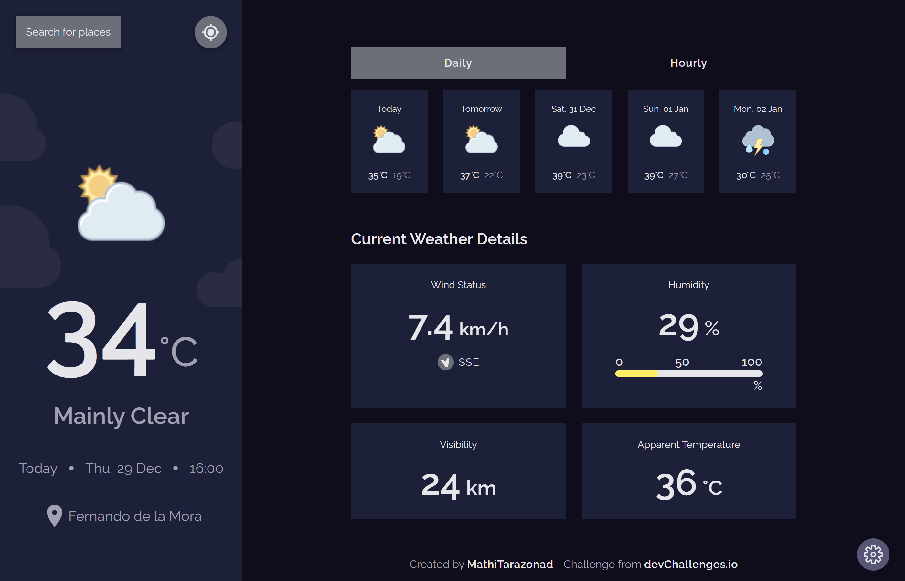

# Devchallenges.io - Weather App Solution

This is a solution to the [Weather App challenge on DevChallenges.io](https://devchallenges.io/challenges/mM1UIenRhK808W8qmLWv).
### Preview

## Table of contents

- [Overview](#overview)
  - [The challenge](#the-challenge)
  - [Screenshots](#screenshots)
  - [Links](#links)
- [My process](#my-process)
  - [Built with](#built-with)
  - [Process](#process)
  - [What I learned](#what-i-learned)
  - [Continued development](#continued-development)
  - [Useful resources](#useful-resources)
- [Author](#author)

## Overview

### The challenge

Users should be able to:

- See the current weather. 
- See the daily weather.
- View the optimal layout for the game depending on their device's screen size.
- Select their current location by searching or via gps with a button.
- Search for the weather of a city by searching.
- Change the temperature unit (Celsius or Fahrenheit).

The next challenges are created by my self to my self:

- **Bonus**: Save countries that were searched and selected.
- **Bonus**: Delete a saved country.
- **Bonus**: See the hourly weather.
- **Bonus**: Change between hourly and daily weather mode, and pass over the next hours.
- **Bonus**: Change between dark and light mode.
- **Bonus**: Add a dropdown menu.

### Screenshots

I only took a few screenshots of mobile and computer examples, the design for medium size devices like a tablet and others are very similar to the mobile design.

[Mobile Today](./screenshots/mobile-today.png)

[Mobile Daily](./screenshots/mobile-daily.png)

[Mobile Details](./screenshots/mobile-details.png)

[Mobile Menu](./screenshots/mobile-menu.png)

[Desktop Dark Design](./screenshots/desktop-dark.png)

[Desktop Light Design](./screenshots/desktop-light.png)

[Desktop Menu](./screenshots/desktop-search.png)

### Links

- Solution URL: https://github.com/Mathitarazonad/Weather-App
- Live Site URL: https://weather-appmt.vercel.app/

## My process

### Built with

- Semantic HTML5 markup
- CSS custom properties
- Flexbox
- Mobile-first workflow
- Node Js
- [Vite](https://vitejs.dev/) - Web App build tool.
- [React](https://reactjs.org/) - JS library
- [Redux Toolkit](https://redux-toolkit.js.org/) - Redux Package for State Management
- [Redux Toolkit Query](https://redux-toolkit.js.org/tutorials/rtk-query) - Redux Data Fetching
- [Express](https://expressjs.com/es/) - NodeJs Framework for Server
- [Sass](https://sass-lang.com/) - CSS Preprocessor
- [Vercel](https://vercel.com) - Hosting Page
- [OpenMeteo API](https://open-meteo.com/) - Weather API
- [GeoApify API](https://www.geoapify.com) - Geolocation API

### Process

First of all, I needed to find two APIs, one for the location things, and another for the weather, the provided by the devChallenge page for this challenge didn't work so I decided to use GeoApify as the location API, and OpenMeteo as my weather API. Then I wanted to store my API key safely, and I learned that the best way to do this was storing it in an env file that were in a backend, so for the first time I entered the backend world and I learned some of the basics to run a backend service and do the things that I wanted.

So the app works as follows, a location API searchs for the information of the location that the user wants to use, for example its current location, so this API sends data about a city by using coordinates. Before continuing with the weather things, I decided to store the locations that the user searched and selected to change between locations and their weather. With the information about the city that this API provides, then we can search for data about the weather of that current location, this weather API also needs to know about of course the coordinates, timezone, and the temperature format that the data will be sent. And finally with all of this data we can show to the user all the information that he wants.

In this challenge I didn't reply the design that the challenges gives, for example, the air pressure, the weather API that I used don't gives data about the air pressure, so I changed for the apparent temperature. Also I added the state name for the cities and moved the temperature changers in a menu and added a light/dark mode changer. Another change but not less important is that a I add weather mode buttons to change it between daily mode that was in the challenge, and hourly mode that I decided to add but only with the next 15 hours. 

### What I learned

*"Use this section to recap over some of your major learnings while working through this project."*

This project made me to enter in the backend world, and I learned some basic about this and also the importance of having some knowledge about this part of the web programming. I learned to store api keys in the backend, that's why I needed to use a backend technology, in this case node Js to store it in a env file, because of this, I needed to fetch data from the backend server that I created with express to use this api key and keep it in secret, that was such a painful study proccess but I learned so much due to this. Know how to use Redux Toolkit Query was another challenge that I covered in this project, and I learned about its great utility. 

Continuing... I learned how to use query parameters in the url to fetch specific data from an API. I think the most important thing that I've learned with this project was the organization, if I didn't organize like I did in this project, It would have been so much harder and now I really see the importance of having an organized project, it makes easier a lot the development and of course when we need to fix bugs.

At last but not less important, I started to use other platforms of hosting that wasn't git hub pages, I was forced to it really, because git hub pages doesn't support a backend service to deploy, and I struggled with this about 2 weeks to only know how to deploy a page that have a client side and a backend, because I even didn't use backend until this project, so deploy a frontend with a backend was an absolutely headache for me. Finally I hosted both of them in vercel, in one page the backend, and in another one the client side.

### Continued development

*"Use this section to outline areas that you want to continue focusing on in future projects. These could be concepts you're still not completely comfortable with or techniques you found useful that you want to refine and perfect."*

Well, how I said, I only studied the basics basics of the backend, so I need to learn a lot about this part of the web development, now I understand the importance of having the basic knowledge about some backend and it is really useful. I thought about to start with Full-Stack apps, but I need to learn a lot more about the backend things before enter a completely new world, and at this moment, I don't think if it is a good idea to focus on several technologies like a full-stack developer or focus on only one, for example the frontend.

### Useful resources

- [Sass Basics](https://sass-lang.com/guide)
- [Redux Toolkit Query Guide](https://redux-toolkit.js.org/rtk-query/overview)
- [Vercel](https://vercel.com/docs)
- [Express](https://expressjs.com/es/guide/routing.html)

## Author

- [Frontend Mentor](https://www.frontendmentor.io/profile/Mathitarazonad)
- [DevChallenges](https://devchallenges.io/portfolio/Mathitarazonad)
- [GitHub](https://github.com/Mathitarazonad)
